<br><br>

<!-- project philosophy -->


> An IoT door lock system that empowers homeowners to remotely control their home door using a mobile application.
>
> It provides multiple secure methods for users to unlock the door, including secret knock pattern, fingerprint scanning, passcode authentication.
>
> Additionally, users can conveniently operate the door from anywhere through the mobile app interface, as well as by accessing the associated camera on the door.


### User Stories

- As a home owner, I want to have a visual confirmation of visitors via the camera feed, so I can identify them before deciding whether to remotely unlock the door or not.
- As a home owner, I want to track my family members and guests when they're leaving the home.
- As a home owner, I want to have access to a log of door activity, including who unlocked the door and at what time, so I can monitor the whole door activity at specific date.
<br><br>
- As a family member, I want the to be able to receive a digital invitation via the mobile app from the home owner, granting me access to the home.
- As a family member, I want to use the fingerprint scanner to unlock the home door, so no need to carry keys and prevent being locked out in case of lossing them.
- As a family member, I want to be notified whenever the doorbell rings or the door is opened, so I keep track of visitors or any door activity.
<br><br>
- As a guest, I want the to be able to receive a digital invitation via the mobile app from the home owner, granting me temporary access to the home during my stay.
- As a guest, I want to be automatically added to the members at home list whenever I arrive at the owner's home location.

<br><br>

<!-- Tech stack -->


### Smart Key is built using the following technologies:

- This project uses the [Flutter app development framework](https://flutter.dev/). Flutter is a cross-platform hybrid app development platform which allows us to use a single codebase for apps on mobile, desktop, and the web.
- This Project uses [Laravel](https://laravel.com/) framework for backend. Laravel serves as a backend framework for PHP web development, offering features and tools that streamline backend processes, such as routing, database management, authentication, and API development, empowering developers to build robust and scalable server-side applications efficiently.
- The door lock system is implemented using [Arduino](https://www.arduino.cc/) modules. These modules control the physical locking mechanism, providing a reliable and programmable hardware solution that integrates seamlessly with the app for secure and efficient access management.
- To send push notifications, the app uses the [Firebase Cloud Messaging](https://pub.dev/packages/flutter_local_notifications), a cross-platform messaging solution that lets you reliably send notification messages into mobile devices.
- To control the physical locking mechanism in real time, the app uses an [MQTT broker](https://mqtt.org/), a lightweight and flexible IoT message exchange and data transmission protocol. This protocol is dedicated to achieving a balance between flexibility and hardware/network resources for IoT developers.
- To connect the arduino to the server, I used [ESP8266](https://www.espressif.com/en/products/socs/esp8266) which is a low-cost Wi-Fi microchip with full TCP/IP stack and microcontroller capability produced by Shanghai-based Chinese manufacturer, Espressif Systems.
- To stream a live video from in front of the door of the house, I used an [ESP32-CAM](https://www.espressif.com/en/news/ESP32_CAM), a small size, low power consumption camera module based on the ESP32. It comes with an OV2640 camera and provides an onboard TF card slot.
- The app uses the font ["Niramit"](https://fonts.google.com/specimen/Niramit) as its main font, and the design of the app adheres to the material design guidelines.

<br><br>

<!-- UI UX -->


> We designed Smart Key using wireframes and mockups, iterating on the design until we reached the ideal layout for easy navigation and a seamless user experience.

- Project Figma design [figma](https://www.figma.com/design/t4rdlMJrAbQdZxu6lGgFt7/Smart-Key-App?node-id=541%3A1262&t=jk0Dh0nWpASl1Cy7-1)

### Mockups

| Splash screen                             | Signup Screen                           | Invite Screen                          |
| --------------------------------------- | ------------------------------------- | ------------------------------------- |
| 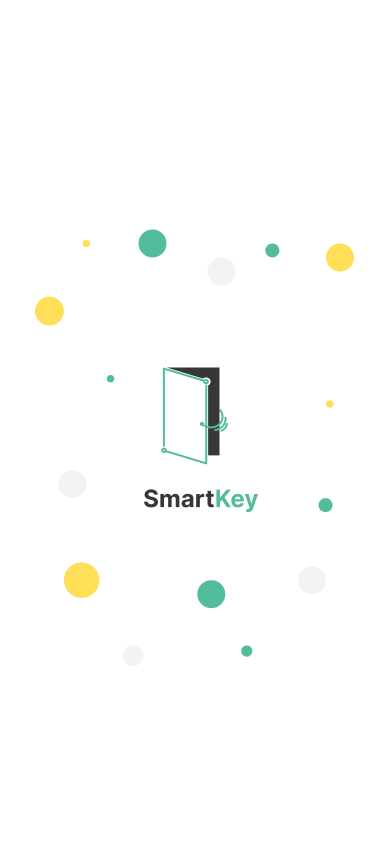 | 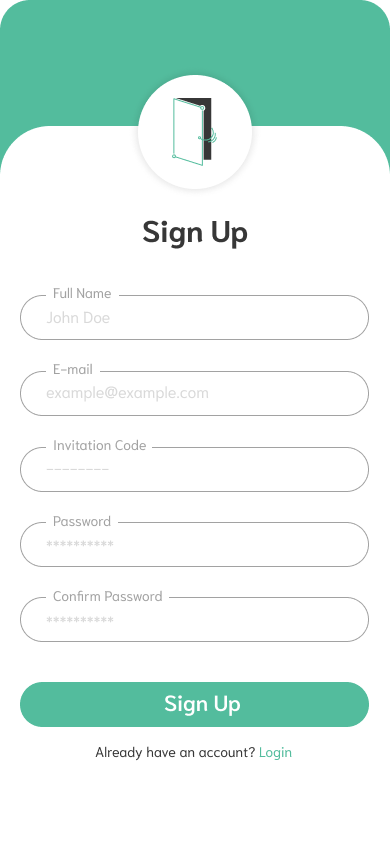 | 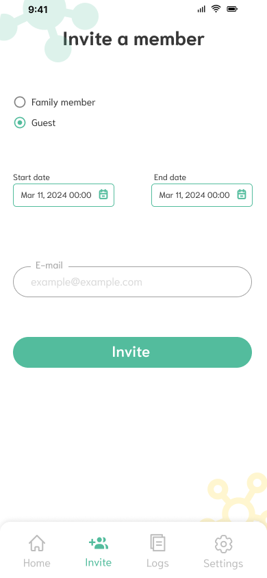 |

<br><br>

<!-- Database Design -->


### Architecting Data Excellence: Innovative Database Design Strategies:

| ER Diagram                             |
| --------------------------------------- |
|  |

<br><br>

<!-- Implementation -->


### User Screens (Mobile)

| Home Screen                              | Invite Screen                         | Secret Knock Screen                          |
| ----------------------------------------- | --------------------------------------- | --------------------------------------- |
| 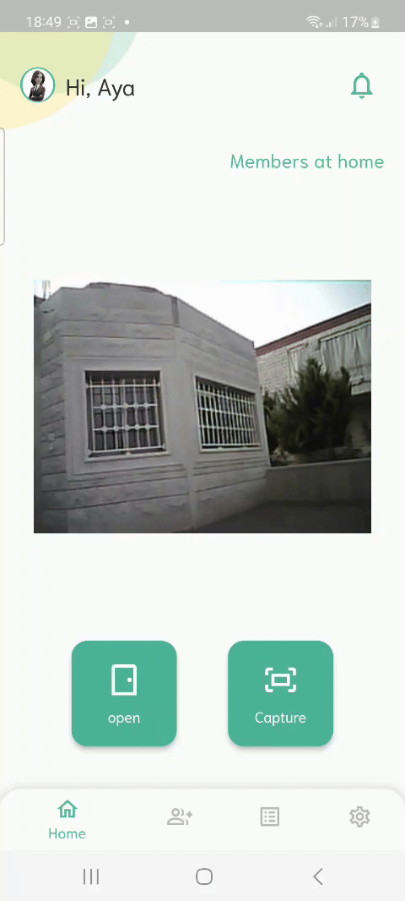 | 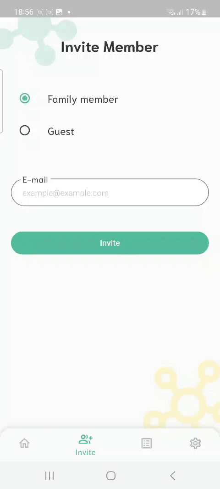 | 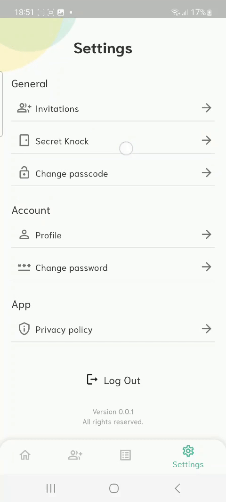 |

| Signup Screen                              | Profile Screen                         | Logs Screen                          |
| ----------------------------------------- | --------------------------------------- | --------------------------------------- |
|  | 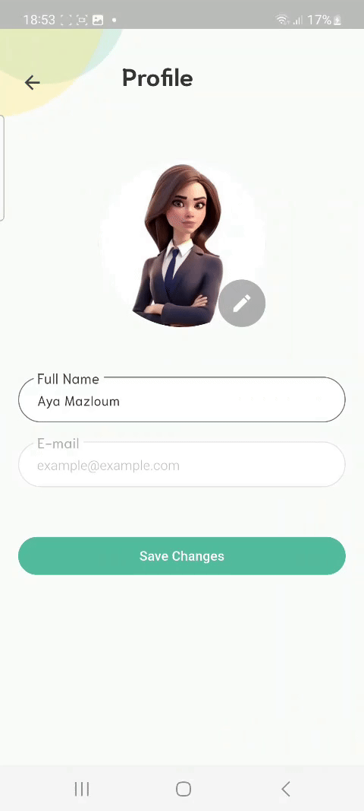 | 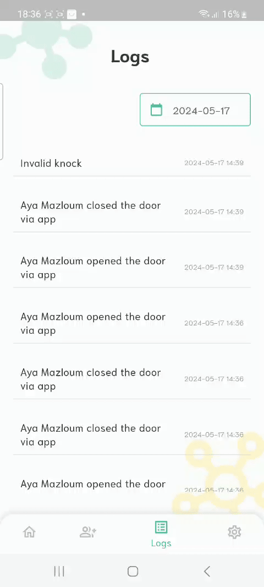 |

| Change Passcode Screen                              | Invitations Screen                         | Change Password Screen                          |
| ----------------------------------------- | --------------------------------------- | --------------------------------------- |
| 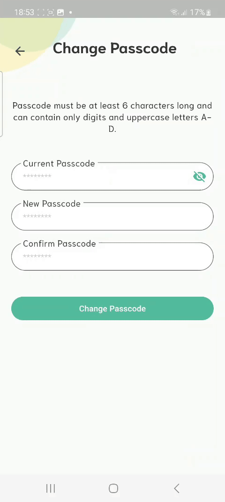 | 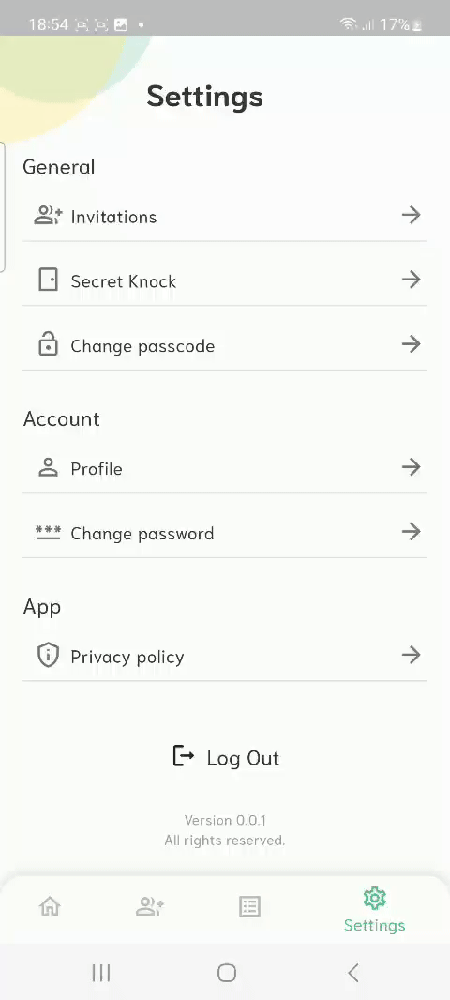 |  |

### Arduino Simulation

| Door Remote Control                              | Secret Knock                         |
| ----------------------------------------- | --------------------------------------- |
|  |  |

| Visitor Notifier                              | Fingerprint                         |
| ----------------------------------------- | --------------------------------------- |
|  |  |

<br><br>

<!-- AWS Deployment -->


### Efficient AI Deployment: Unleashing the Potential with AWS Integration:

- This project leverages AWS deployment strategies to seamlessly integrate and deploy natural language processing models. With a focus on scalability, reliability, and performance, we ensure that AI applications powered by these models deliver robust and responsive solutions for diverse use cases.

<br><br>

<!-- Unit Testing -->


### Precision in Development: Harnessing the Power of Unit Testing:

- This project employs rigorous unit testing methodologies to ensure the reliability and accuracy of code components. By systematically evaluating individual units of the software, we guarantee a robust foundation, identifying and addressing potential issues early in the development process.

<br>

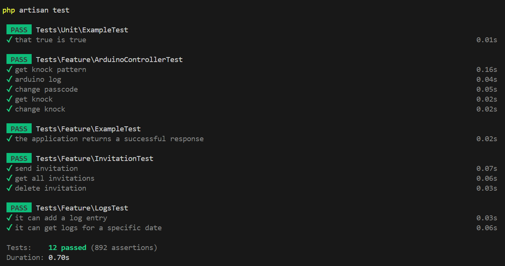

<br><br>

<!-- How to run -->


> To set up Smart Key locally, follow these steps:

### Prerequisites

-   ESP8266 Module (Hardware)
-   ESP32-CAM Module (Hardware)
-   FT232R USB to Serial/TTL Converter Module (Hardware)
-   Fingerprint Scanner (Hardware)
-   Sound Sensor Module (Hardware)
-   Keypad 4x4 (Hardware)
-   Arduino Mega (Hardware)
-   Servo motor (Hardware)
-   Solenoid (Hardware)
-   9V Battery (Hardware)
-   5V Relay Module (Hardware)
-   3 Push Buttons (Hardware)
-   Connecting Wires (Hardware)

### Installation

1. Clone the repo
    ```sh
    git clone https://github.com/ayaamazloum/Smart-Key.git
    ```
2. Install database server: Any Apache HTTP Server, MariaDB database server, recommended [XAMPP](https://www.apachefriends.org/download.html).

3. Install [Composer](https://getcomposer.org/download/)

4. Go to laravel-server directory
    ```sh
    cd laravel-server
    ```
5. Run database migrations
    ```sh
    php artisan migrate
    ```
6. Run database seeders
    ```sh
    php artisan db:seed
    ```
7. Run the server on computer's local IP address 
    ```sh
    php artisan serve --host local_IP_address
    ```
8. Install [Flutter SDK](https://docs.flutter.dev/get-started/install?gclid=Cj0KCQiAveebBhD_ARIsAFaAvrEXbca0gKEuW9ROxwC86eiEtJUUO5tm-AIIzds41AXpzsjkbESCw2EaAsTwEALw_wcB&gclsrc=aw.ds)

9. Go to smart_key directory
    ```sh
    cd smart_key
    ```
10. Install pub packages
    ```sh
    flutter pub get
    ```
11. In lib/utils/constants.dart file, change the following variables to match your server IP address
    ```dart
    String apiUrl = 'http://server_IP_address:8000/api';
    String serverImagesUrl = 'http://server_IP_address:8000/profile_pictures';
    ```
12. Run smart_key
    ```sh
    flutter run
    ```

### Hardware Setup 

-   Uploading code

1. Connect yor hardware as shown in the fritzing circuit inside arduino directory

2. Connect the arduino to the computer

3. Install [Arduino IDE](https://docs.arduino.cc/software/ide-v2/tutorials/getting-started/ide-v2-downloading-and-installing) (You can use alternative aurduino IDE's)

4. In arduino/DoorSystem/DoorSystem.ino, change the following variables to match your wifi credentials and setup
    ```cpp
    const char* ssid = "your_wifi_ssid";
    const char* password = "your_wifi_password";

    const String serverUrl = "server_IP_address:8000/api";
    ```

5. In arduino/CameraWebServer/CameraWebServer.ino, change the following variables to match your wifi credentials
    ```cpp
    const char* ssid = "your_wifi_ssid";
    const char* password = "your_wifi_password";
    ```

6. Upload each arduino code into its corresponding board

7. After uploading CameraWebServer.ino code, open serial monitor in Arduino IDE (on the top right of the screen), and whenever you get the camera server IP address copy it.

8. In smart_key/lib/constants.dart, paste the copied camera server IP address into this line
    ```dart
    String streamUrl = 'paste_it_here:81/stream';
    ```
12. Run smart_key again
    ```sh
    flutter run
    ```

Now, you are all set to control the door system through the application, with all other features working.