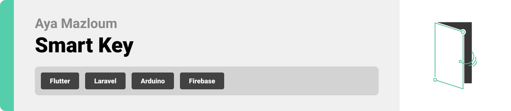
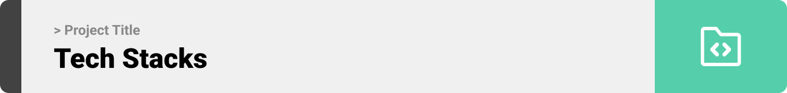
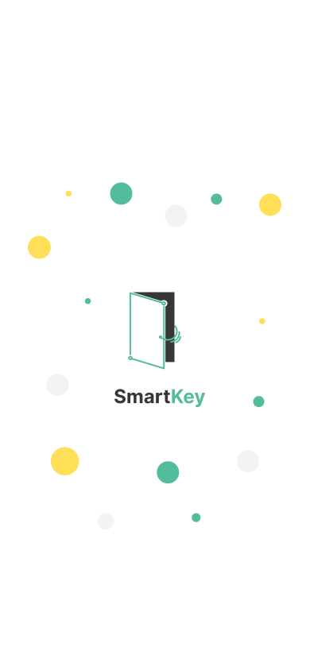
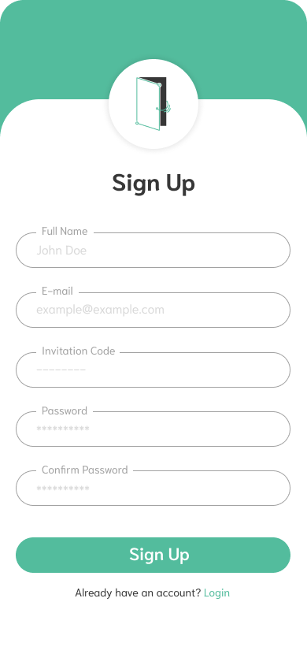
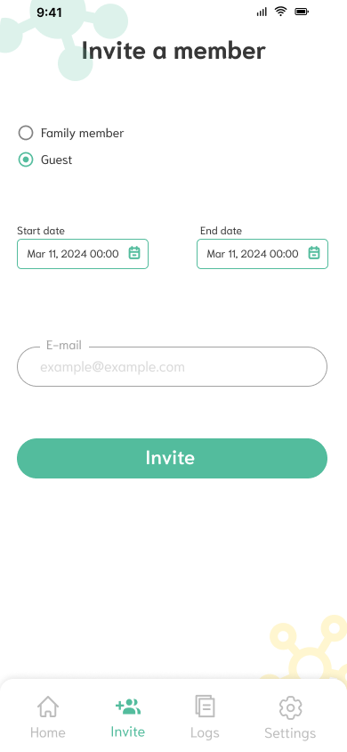
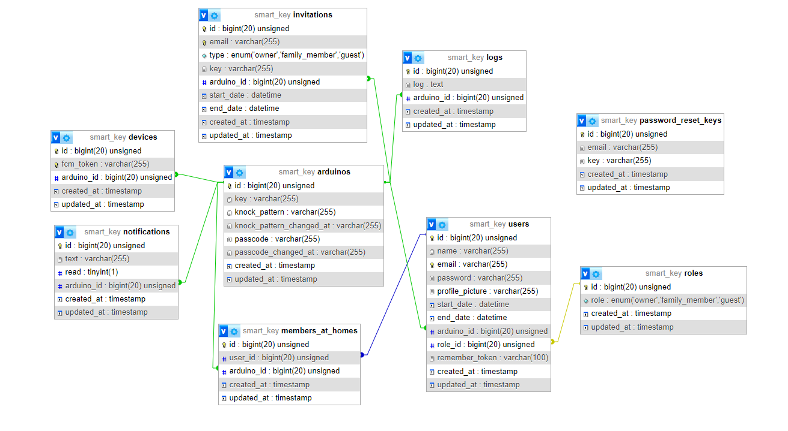
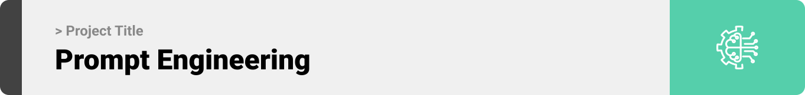

<br><br>

<!-- project philosophy -->


> An IoT door lock system empowers homeowners to remotely control their property's door via a mobile app.
>
> It provides multiple secure methods for users to unlock the door, including secret knock pattern, fingerprint scanning, passcode authentication.
>
> Additionally, users can conveniently operate the door from anywhere through the mobile app interface, as well as by accessing the associated camera on the door.


### User Stories

- As a home owner, I want to have a visual confirmation of visitors via the camera feed, so I can identify them before deciding whether to remotely unlock the door or not.
- As a home owner, I want to track my family members and guests when they're leaving the home.
- As a home owner, I want to have access to a log of door activity, including who unlocked the door and at what time, so I can monitor the whole door activity at specific date.
- As a family member, I want the to be able to receive a digital invitation via the mobile app from the home owner, granting me access to the home.
- As a family member, I want to use the fingerprint scanner to unlock the home door, so no need to carry keys and prevent being locked out in case of lossing them.
- As a family member, I want to be notified whenever the doorbell rings or the door is opened, so I keep track of visitors or any door activity.
- As a guest, I want the to be able to receive a digital invitation via the mobile app from the home owner, granting me temporary access to the home during my stay.
- As a guest, I want to be automatically added to the members at home list whenever I arrive at the owner's home location.

<br><br>

<!-- Tech stack -->


### Smart Key is built using the following technologies:

- This project uses the [Flutter app development framework](https://flutter.dev/). Flutter is a cross-platform hybrid app development platform which allows us to use a single codebase for apps on mobile, desktop, and the web.
- This Project uses [Laravel](https://laravel.com/) framework for backend. Laravel serves as a backend framework for PHP web development, offering features and tools that streamline backend processes, such as routing, database management, authentication, and API development, empowering developers to build robust and scalable server-side applications efficiently.
- The door lock system is implemented using Arduino modules. These modules control the physical locking mechanism, providing a reliable and programmable hardware solution that integrates seamlessly with the app for secure and efficient access management.
- To send push notifications, the app uses the [Firebase Cloud Messaging](https://pub.dev/packages/flutter_local_notifications), a cross-platform messaging solution that lets you reliably send notification messages into mobile devices.
- The app uses the font ["Niramit"](https://fonts.google.com/specimen/Niramit) as its main font, and the design of the app adheres to the material design guidelines.

<br><br>

<!-- UI UX -->


> We designed Smart Key using wireframes and mockups, iterating on the design until we reached the ideal layout for easy navigation and a seamless user experience.

- Project Figma design [figma](https://www.figma.com/design/t4rdlMJrAbQdZxu6lGgFt7/Smart-Key-App?node-id=541%3A1262&t=jk0Dh0nWpASl1Cy7-1)

### Mockups

| Splash screen                             | Signup Screen                           | Invite Screen                          |
| --------------------------------------- | ------------------------------------- | ------------------------------------- |
|  |  |  |

<br><br>

<!-- Database Design -->


### Architecting Data Excellence: Innovative Database Design Strategies:

| --------------------------------------- |
|  |

<br><br>

<!-- Implementation -->


### User Screens (Mobile)

| Login screen                              | Register screen                         | Landing screen                          | Loading screen                          |
| ----------------------------------------- | --------------------------------------- | --------------------------------------- | --------------------------------------- |
|  |  |  |  |
| Home screen                               | Menu Screen                             | Order Screen                            | Checkout Screen                         |
|  |  |  |  |

### Admin Screens (Web)

| Login screen                            | Register screen                       | Landing screen                        |
| --------------------------------------- | ------------------------------------- | ------------------------------------- |
|  |  |  |
| Home screen                             | Menu Screen                           | Order Screen                          |
|  |  |  |

<br><br>

<!-- Prompt Engineering -->


### Mastering AI Interaction: Unveiling the Power of Prompt Engineering:

- This project uses advanced prompt engineering techniques to optimize the interaction with natural language processing models. By skillfully crafting input instructions, we tailor the behavior of the models to achieve precise and efficient language understanding and generation for various tasks and preferences.

<br><br>

<!-- AWS Deployment -->


### Efficient AI Deployment: Unleashing the Potential with AWS Integration:

- This project leverages AWS deployment strategies to seamlessly integrate and deploy natural language processing models. With a focus on scalability, reliability, and performance, we ensure that AI applications powered by these models deliver robust and responsive solutions for diverse use cases.

<br><br>

<!-- Unit Testing -->


### Precision in Development: Harnessing the Power of Unit Testing:

- This project employs rigorous unit testing methodologies to ensure the reliability and accuracy of code components. By systematically evaluating individual units of the software, we guarantee a robust foundation, identifying and addressing potential issues early in the development process.

<br><br>

<!-- How to run -->


> To set up Coffee Express locally, follow these steps:

### Prerequisites

This is an example of how to list things you need to use the software and how to install them.

- npm
  ```sh
  npm install npm@latest -g
  ```

### Installation

_Below is an example of how you can instruct your audience on installing and setting up your app. This template doesn't rely on any external dependencies or services._

1. Get a free API Key at [example](https://example.com)
2. Clone the repo
   git clone [github](https://github.com/your_username_/Project-Name.git)
3. Install NPM packages
   ```sh
   npm install
   ```
4. Enter your API in `config.js`
   ```js
   const API_KEY = "ENTER YOUR API";
   ```

Now, you should be able to run Coffee Express locally and explore its features.
